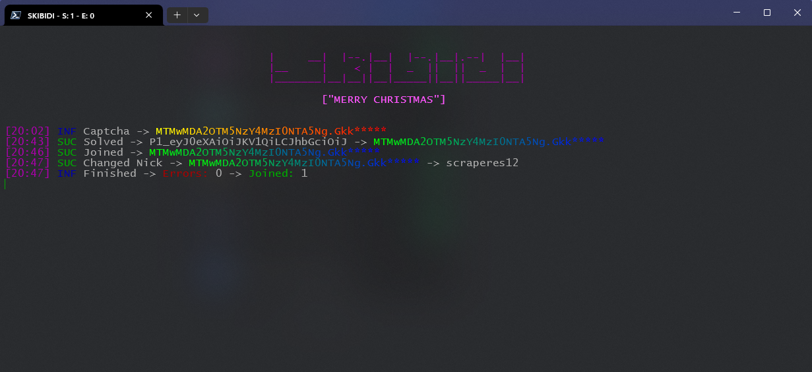

# Skibidi Discord Token Joiner  
A **powerful**, completely **free** Discord Token Joiner – Unflagged, Solver Supported, and **always up-to-date**! 🚀  

---

## Why this Repo?  
Way too many people sell joiners or boosters for ridiculous prices. So I thought: **why not make one for free?** Now everyone can use it without paying a cent!  

If you’re looking for a **better, safer, and unflagged** solution, I recommend checking out **[NexusTools](https://nexustools.de/)**. They offer top-quality joiners with full source code, lifetime updates, and soon a more reliable solvers.

> **Heads Up:** The solver included here **isn’t mine**. I just added it for convenience, but if your tokens get locked or flagged, that’s on you. I have **no partnerships** with anyone, and this solver is just as-is. Use at your own risk.

---

## Installation  
1. Install **Python 3.x** (get the latest version).  
2. Download this repo.  
3. Add your tokens to `input/tokens.txt`.  
4. (Optional) Add your proxies to `input/proxies.txt` – needed if you’re using the solver.

---

## Disclaimer  

This tool is for **educational purposes only**. Anything you do with it is **your responsibility**, not mine.  

This Joiner isnt great and coded very shitty xd, so dont blame me if u have any issues -> **[JomanHub](https://discord.gg/NnSWJ2jUy2)**

---

## Preview 

### Enjoy! 🎉
